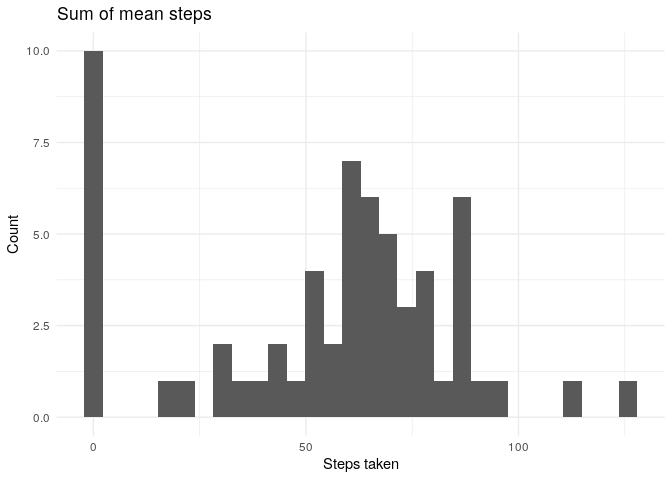

Reproducible Research Data
================

> The overall goal of this project is to use personal activity monitoring data of a step counter throughout the day in 5-minute intervals between October and November - 2012, and build a literate exploratory data analysis aimed at reproducibility.

## Tools Used

  - R language compiler
  - R base graphic devices
  - Tidyverse library packages
  - RMarkdown library package
  - Knitr library package

## Files

  - **Raw data set**: [Activity Monitoring Data](https://d396qusza40orc.cloudfront.net/repdata%2Fdata%2Factivity.zip)
  - **[CODEBOOK](https://github.com/vcwild/rep-data/blob/master/PA1_template.md)**:
    step-by-step book explaining the code
    processing.
  - **[Figures](https://github.com/vcwild/rep-data/tree/master/PA1_template_files/figure-html)**:
    the plotted images
  - **[PA1_template.Rmd](https://github.com/vcwild/rep-data/blob/master/PA1_template.Rmd)**: the script to compile the project from source

## Build from Source

Inside the project root folder, execute the following

```
R
library(rmarkdown)
rmarkdown::render("PA1_template.Rmd", "html_document")
```
# CODEBOOK

## Set the libraries to use and study reproducibility


```r
library(tidyverse)
```

```
## ── Attaching packages ───────────────────────────────────────────────────────────────────────────────── tidyverse 1.3.0 ──
```

```
## ✓ ggplot2 3.3.0     ✓ purrr   0.3.4
## ✓ tibble  3.0.1     ✓ dplyr   0.8.5
## ✓ tidyr   1.0.2     ✓ stringr 1.4.0
## ✓ readr   1.3.1     ✓ forcats 0.5.0
```

```
## ── Conflicts ──────────────────────────────────────────────────────────────────────────────────── tidyverse_conflicts() ──
## x dplyr::filter() masks stats::filter()
## x dplyr::lag()    masks stats::lag()
```

```r
library(RColorBrewer)
set.seed(144)
```


## Loading and preprocessing the data


```r
# unzip("activity.zip")
# file.remove("activity.zip")
```


```r
activity <- read_csv("activity.csv")
```

```
## Parsed with column specification:
## cols(
##   steps = col_double(),
##   date = col_date(format = ""),
##   interval = col_double()
## )
```

```r
glimpse(activity)
```

```
## Rows: 17,568
## Columns: 3
## $ steps    <dbl> NA, NA, NA, NA, NA, NA, NA, NA, NA, NA, NA, NA, NA, NA, NA, …
## $ date     <date> 2012-10-01, 2012-10-01, 2012-10-01, 2012-10-01, 2012-10-01,…
## $ interval <dbl> 0, 5, 10, 15, 20, 25, 30, 35, 40, 45, 50, 55, 100, 105, 110,…
```

Count number of NAs


```r
activity %>%
    summarize_all(funs(sum(is.na(.))))
```

```
## Warning: funs() is soft deprecated as of dplyr 0.8.0
## Please use a list of either functions or lambdas: 
## 
##   # Simple named list: 
##   list(mean = mean, median = median)
## 
##   # Auto named with `tibble::lst()`: 
##   tibble::lst(mean, median)
## 
##   # Using lambdas
##   list(~ mean(., trim = .2), ~ median(., na.rm = TRUE))
## This warning is displayed once per session.
```

```
## # A tibble: 1 x 3
##   steps  date interval
##   <int> <int>    <int>
## 1  2304     0        0
```


## What is mean total number of steps taken per day?


```r
mean_steps_day <- activity %>%
    group_by(date) %>%
    drop_na() %>% 
    summarize(
        mean.steps = mean(steps),
        interval = sum(interval)
    )

mean_steps_day
```

```
## # A tibble: 53 x 3
##    date       mean.steps interval
##    <date>          <dbl>    <dbl>
##  1 2012-10-02      0.438   339120
##  2 2012-10-03     39.4     339120
##  3 2012-10-04     42.1     339120
##  4 2012-10-05     46.2     339120
##  5 2012-10-06     53.5     339120
##  6 2012-10-07     38.2     339120
##  7 2012-10-09     44.5     339120
##  8 2012-10-10     34.4     339120
##  9 2012-10-11     35.8     339120
## 10 2012-10-12     60.4     339120
## # … with 43 more rows
```

```r
ggplot(mean_steps_day, aes(mean.steps)) +
    geom_histogram(bins = 30) +
    labs(
        title = "Sum of mean steps",
        x = "Steps taken",
        y = "Count"
    ) +
    theme_minimal()
```

<!-- -->

```r
ggplot(mean_steps_day, aes(date, mean.steps)) +
    geom_bar(stat = "identity") +
    labs(
        title = "Mean of steps",
        x = "Date",
        y = "Mean steps"
    ) +
    theme_minimal()
```

<!-- -->


```r
median_steps_day <- activity %>% 
    group_by(date) %>% 
    drop_na() %>%
    filter(steps != 0) %>% 
    summarize(
        median.steps = median(steps),
        interval = sum(interval)
    )

median_steps_day
```

```
## # A tibble: 53 x 3
##    date       median.steps interval
##    <date>            <dbl>    <dbl>
##  1 2012-10-02         63       4425
##  2 2012-10-03         61      97695
##  3 2012-10-04         56.5   125300
##  4 2012-10-05         66      95090
##  5 2012-10-06         67     132435
##  6 2012-10-07         52.5   138005
##  7 2012-10-09         48     118665
##  8 2012-10-10         56.5   132915
##  9 2012-10-11         35      92745
## 10 2012-10-12         46     138400
## # … with 43 more rows
```

```r
ggplot(median_steps_day, aes(median.steps)) +
    geom_histogram(bins = 30) +
    labs(
        title = "Sum of median steps",
        x = "Steps taken",
        y = "Count"
    ) +
    theme_minimal()
```

<!-- -->

```r
ggplot(median_steps_day, aes(date, median.steps)) +
    geom_bar(stat = "identity") +
    labs(
        title = "Median of steps",
        x = "Date",
        y = "Median steps"
    ) +
    theme_minimal()
```

<!-- -->


## What is the average daily activity pattern?


```r
mean_interval <- activity %>%
    drop_na() %>% 
    group_by(interval) %>% 
    summarize(
        mean.steps = mean(steps)
    )

mean_interval
```

```
## # A tibble: 288 x 2
##    interval mean.steps
##       <dbl>      <dbl>
##  1        0     1.72  
##  2        5     0.340 
##  3       10     0.132 
##  4       15     0.151 
##  5       20     0.0755
##  6       25     2.09  
##  7       30     0.528 
##  8       35     0.868 
##  9       40     0     
## 10       45     1.47  
## # … with 278 more rows
```

```r
ggplot(mean_interval, aes(interval, mean.steps)) +
    geom_line() +
    labs(
        title = "Average daily activity",
        x = "Time (minutes)",
        y = "Global mean steps",
        color = ""
    ) +
    theme_minimal()
```

<!-- -->

## Which 5-minute interval, on average across all the days in the dataset, contains the maximum number of steps?


```r
mean_interval %>% 
    group_by(interval) %>% 
    arrange(desc(mean.steps))
```

```
## # A tibble: 288 x 2
## # Groups:   interval [288]
##    interval mean.steps
##       <dbl>      <dbl>
##  1      835       206.
##  2      840       196.
##  3      850       183.
##  4      845       180.
##  5      830       177.
##  6      820       171.
##  7      855       167.
##  8      815       158.
##  9      825       155.
## 10      900       143.
## # … with 278 more rows
```


## Imputing missing values

Compare means


```r
mean_act <- mean(activity$steps, na.rm = TRUE)
mean_act
```

```
## [1] 37.3826
```

Imputing mean of that day on missing values


```r
iactivity <- activity %>%
    mutate(steps = ifelse(is.na(steps), 0, steps)) %>% 
    group_by(date) %>% 
    mutate(
        steps = ifelse(steps==0, mean(steps), steps)
    ) %>%
    ungroup()
 
mean_iact <- mean(iactivity$steps)
mean_iact
```

```
## [1] 55.17414
```

## What is the impact of imputing missing data on the estimates of the total daily number of steps?
Mean of 37.3825996 steps for NAs removed.  
Mean of 55.1741376 steps for imputed mean.

## Make a histogram of the total number of steps taken each day and Calculate and report the mean and median total number of steps taken per day. Do these values differ from the estimates from the first part of the assignment? 


```r
imean_steps_day <- iactivity %>%
    group_by(date) %>%
    summarize(
        mean.steps = mean(steps),
        interval = sum(interval)
    )

imean_steps_day
```

```
## # A tibble: 61 x 3
##    date       mean.steps interval
##    <date>          <dbl>    <dbl>
##  1 2012-10-01      0       339120
##  2 2012-10-02      0.872   339120
##  3 2012-10-03     67.7     339120
##  4 2012-10-04     69.5     339120
##  5 2012-10-05     78.5     339120
##  6 2012-10-06     87.4     339120
##  7 2012-10-07     62.2     339120
##  8 2012-10-08      0       339120
##  9 2012-10-09     74.3     339120
## 10 2012-10-10     56.3     339120
## # … with 51 more rows
```

```r
ggplot(imean_steps_day, aes(mean.steps)) +
    geom_histogram(bins = 30) +
    labs(
        title = "Sum of mean steps",
        x = "Steps taken",
        y = "Count"
    ) +
    theme_minimal()
```

<!-- -->

```r
ggplot(imean_steps_day, aes(date, mean.steps)) +
    geom_bar(stat = "identity") +
    labs(
        title = "Mean of steps",
        x = "Date",
        y = "Mean steps"
    ) +
    theme_minimal()
```

<!-- -->


```r
imedian_steps_day <- iactivity %>% 
    group_by(date) %>%
    summarize(
        median.steps = median(steps),
        interval = sum(interval)
    )

imedian_steps_day
```

```
## # A tibble: 61 x 3
##    date       median.steps interval
##    <date>            <dbl>    <dbl>
##  1 2012-10-01        0       339120
##  2 2012-10-02        0.438   339120
##  3 2012-10-03       39.4     339120
##  4 2012-10-04       42.1     339120
##  5 2012-10-05       46.2     339120
##  6 2012-10-06       53.5     339120
##  7 2012-10-07       38.2     339120
##  8 2012-10-08        0       339120
##  9 2012-10-09       44.5     339120
## 10 2012-10-10       34.4     339120
## # … with 51 more rows
```

```r
ggplot(imedian_steps_day, aes(median.steps)) +
    geom_histogram(bins = 30) +
    labs(
        title = "Sum of median steps",
        x = "Steps taken",
        y = "Count"
    ) +
    theme_minimal()
```

<!-- -->

```r
ggplot(imedian_steps_day, aes(date, median.steps)) +
    geom_bar(stat = "identity") +
    labs(
        title = "Median of steps",
        x = "Date",
        y = "Median steps"
    ) +
    theme_minimal()
```

<!-- -->

Inserting imputed values allowed to remove `drop_na` and to remove `filter !=0` and still get significant median values.

---

Joining datasets and plotting mean differences


```r
# Checking dimensions
dim(mean_steps_day)
```

```
## [1] 53  3
```

```r
dim(imean_steps_day)
```

```
## [1] 61  3
```


```r
# Joining datasets and pivoting into one mean column
join_mean <- left_join(imean_steps_day, mean_steps_day, by = c("date", "interval"))

meta <- pivot_longer(data = join_mean, c(`mean.steps.x`, `mean.steps.y`), names_to = "group", values_to="mean.steps")

group_mean <- meta %>%
    mutate(
        group = ifelse(group == "mean.steps.x", "imean", "mean")
    ) %>% 
    drop_na()

# Plotting results

ggplot(group_mean, aes(date, mean.steps, group = group, fill = group)) +
    geom_bar(stat = "identity") +
    labs(
        title = "Mean difference between imputed and non-imputed datasets",
        x = "Date",
        y = "Mean of steps"
    ) + 
    theme_minimal()
```

<!-- -->

The imputed data received considerable mean increase.

## Are there differences in activity patterns between weekdays and weekends?


```r
day <- weekdays(activity$date)
daylevel <- vector()
for (i in 1:nrow(activity)) {
    if (day[i] == "Saturday") {
        daylevel[i] <- "Weekend"
    } else if (day[i] == "Sunday") {
        daylevel[i] <- "Weekend"
    } else {
        daylevel[i] <- "Weekday"
    }
}
activity$daylevel <- daylevel
activity$daylevel <- factor(activity$daylevel)

dailysteps <- aggregate(steps ~ interval + daylevel, data = activity, mean)
names(dailysteps) <- c("interval", "daylevel", "steps")

glimpse(dailysteps)
```

```
## Rows: 576
## Columns: 3
## $ interval <dbl> 0, 5, 10, 15, 20, 25, 30, 35, 40, 45, 50, 55, 100, 105, 110,…
## $ daylevel <fct> Weekday, Weekday, Weekday, Weekday, Weekday, Weekday, Weekda…
## $ steps    <dbl> 2.3333333, 0.4615385, 0.1794872, 0.2051282, 0.1025641, 1.512…
```

```r
ggplot(dailysteps, aes(interval, steps, group = daylevel, color = daylevel)) + 
    facet_grid(daylevel ~ .) +
    geom_line() +
    labs(
        x = "Time (mins)",
        y = "Steps",
        color = "Type"
    ) +
    theme_bw()
```

<!-- -->

